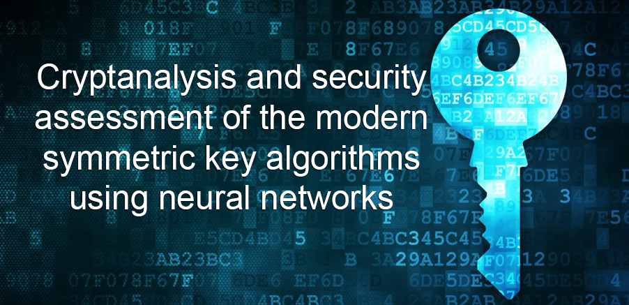

# Summary
This repository introduces new methodology for determining mutual information between secret key and cipher message. The methodology is based on using Artificial Intelligence (AI), specifically   neural networks, to determine correlations that can be found in the weak and medium encryption algorithms. Results show the successful performance of proposed methodology by applying it to the Simple Crypt algorithm (developed for purpose of this work), and today's most security algorithms, AES and DES.

# Development environment
Code for generating the dataset, as well as the code for training the neural networks is developed on Ubuntu 19.04 OS. Following hardware specification consists of:
- CPU: Intel Core i7-4770 CPU @ 3.40GHz x 8
- GPU karta: GeForce GTX 1080 Ti/PCIe/SSE2
- RAM: Kingston HyperX Fury Red 16 GB (2 x 8 GB)

The chosen language is Python  3.6. The reason being is a wast number of functionalities, libraries and fast development rate. Most significant, used Python libraries, are:
- TensorFlow v1.11.0
- PyCrypto v2.6.1
- NumPy v1.16.3
- Scikit-learn v0.21
- TensorBoard v1.11.0

from which TensorFlow is the major for training the neural network, while PyCrypto for generating training dataset.

To execute experiments as optimal as possible, CUDA drivers are used alongside GPU drivers. This enables TensorFlow to do all calculations directly on GPU and by that to speed up the training process of the network.

For having an easier way for adjustment and setup, Docker is used with Nvidia support. This enables an isolated environment for development and testing.

# Results
### Character
#### Simple Crypt
<table>
	<tr>
		<td>Simple Crypt train results on single character dataset.</td>
		<td>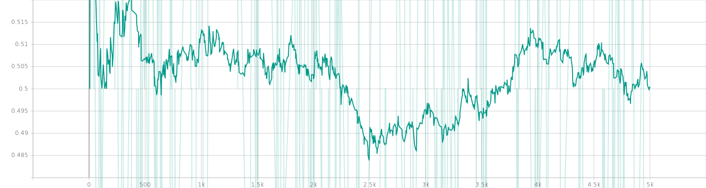</td>
	</tr>
</table>
<table>
	<tr>
		<td>Simple Crypt test results on single character dataset.</td>
		<td></td>
	</tr>
</table>

#### AES
<table>
	<tr>
		<td>AES train results on single character dataset.</td>
		<td>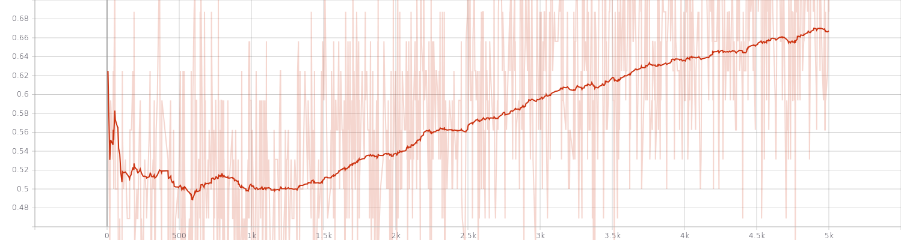</td>
	</tr>
</table>
<table>
	<tr>
		<td>AES test results on single character dataset.</td>
		<td>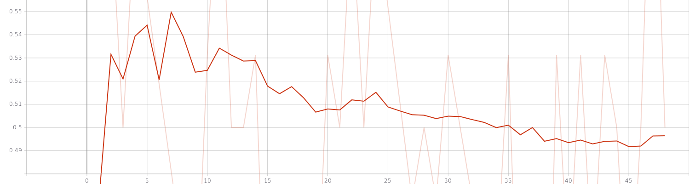</td>
	</tr>
</table>

#### DES
<table>
	<tr>
		<td>DES train results on single character dataset.</td>
		<td>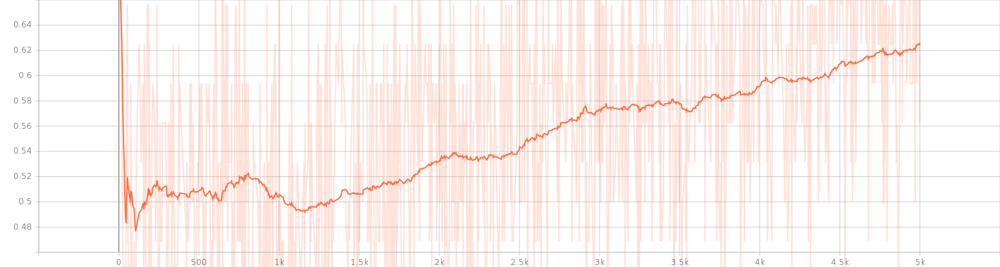</td>
	</tr>
</table>
<table>
	<tr>
		<td>DES test results on single character dataset.</td>
		<td>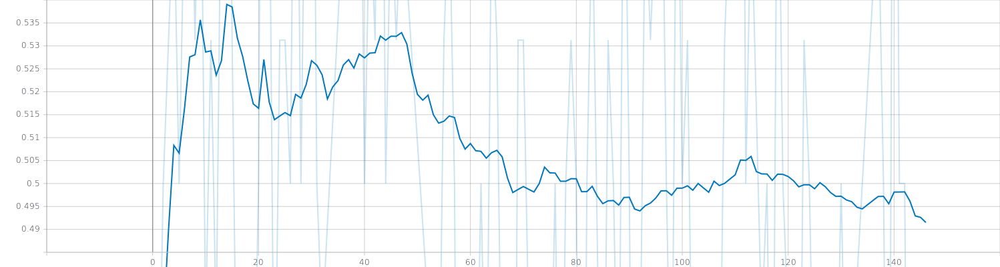</td>
	</tr>
</table>

### Word
#### Simple Crypt
<table>
	<tr>
		<td>Simple Crypt train results on single word dataset.</td>
		<td>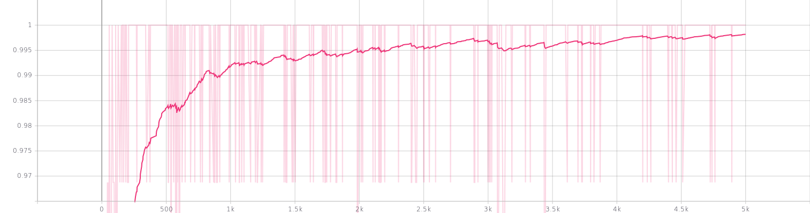</td>
	</tr>
</table>
<table>
	<tr>
		<td>Simple Crypt test results on single word dataset.</td>
		<td>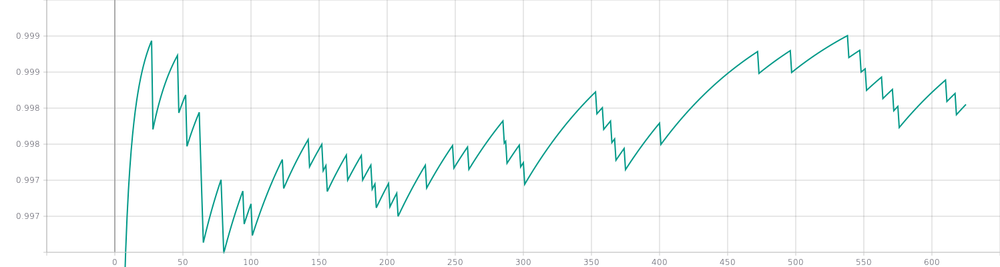</td>
	</tr>
</table>

#### AES
<table>
	<tr>
		<td>AES train results on single word dataset.</td>
		<td>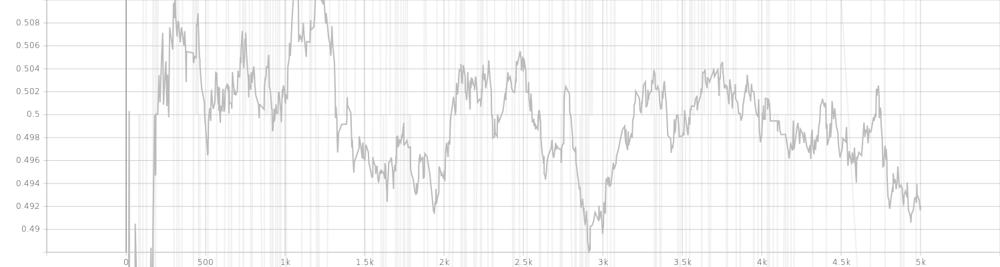</td>
	</tr>
</table>
<table>
	<tr>
		<td>AES test results on single word dataset.</td>
		<td>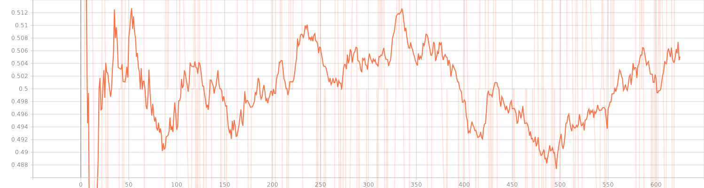</td>
	</tr>
</table>

#### DES
<table>
	<tr>
		<td>DES train results on single word dataset.</td>
		<td>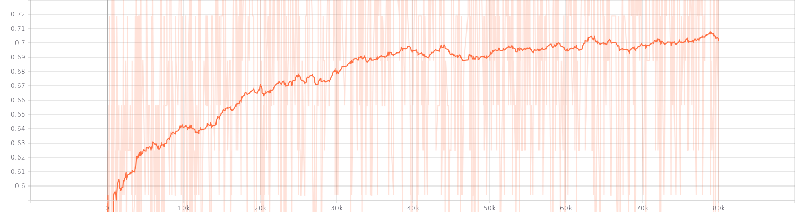</td>
	</tr>
</table>
<table>
	<tr>
		<td>DES test results on single word dataset.</td>
		<td>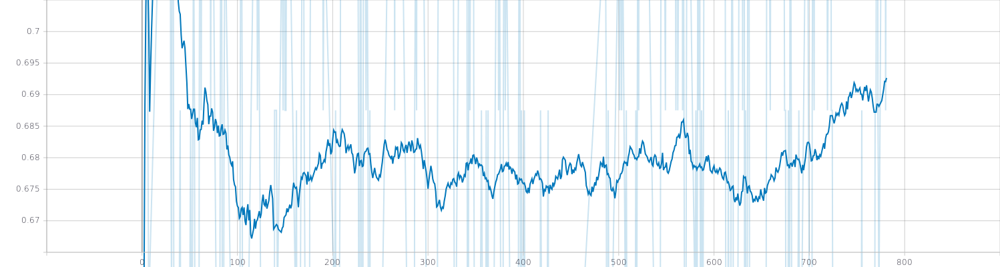</td>
	</tr>
</table>

### Sentence
#### Simple Crypt
<table>
	<tr>
		<td>Simple Crypt train results on single sentence dataset.</td>
		<td>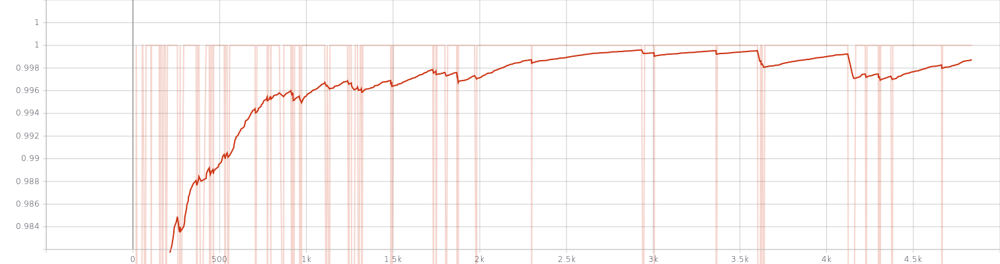</td>
	</tr>
</table>
<table>
	<tr>
		<td>Simple Crypt test results on single sentence dataset.</td>
		<td>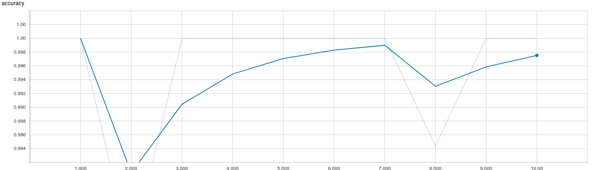</td>
	</tr>
</table>

#### AES
<table>
	<tr>
		<td>AES train results on single sentence dataset.</td>
		<td>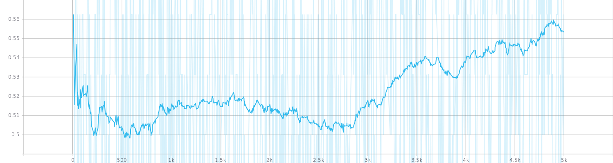</td>
	</tr>
</table>
<table>
	<tr>
		<td>AES test results on single sentence dataset.</td>
		<td>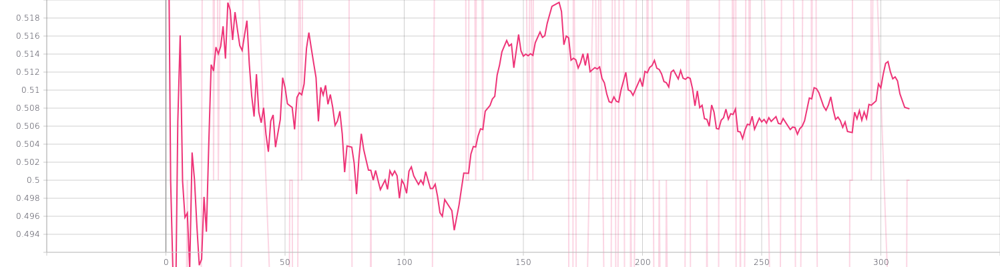</td>
	</tr>
</table>

#### DES
<table>
	<tr>
		<td>DES train results on single sentence dataset.</td>
		<td>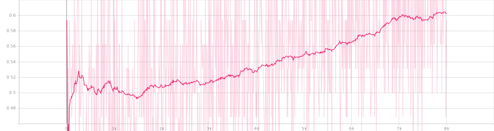</td>
	</tr>
</table>
<table>
	<tr>
		<td>DES test results on single sentence dataset.</td>
		<td>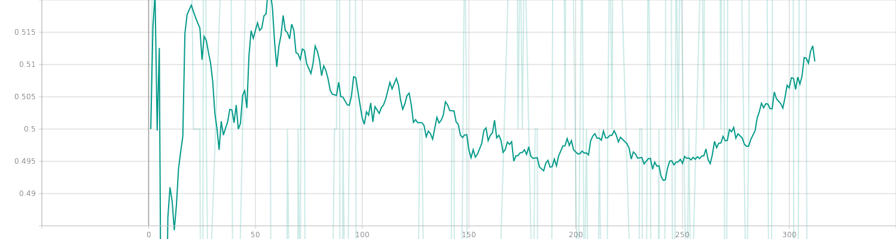</td>
	</tr>
</table>

### Essay
#### Simple Crypt
##### Full cipher length
<table>
	<tr>
		<td>Simple Crypt train results on full cipher length.</td>
		<td>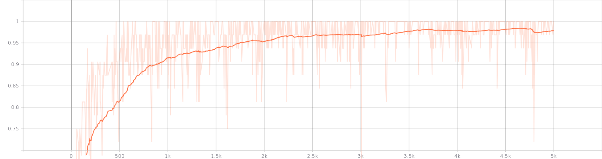</td>
	</tr>
</table>
<table>
	<tr>
		<td>Simple Crypt test results on full cipher length.</td>
		<td>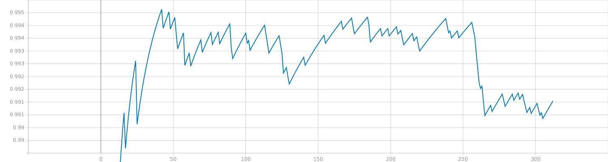</td>
	</tr>
</table>

##### Partial cipher length
<table>
	<tr>
		<td>Simple Crypt train results on partial cipher length.</td>
		<td>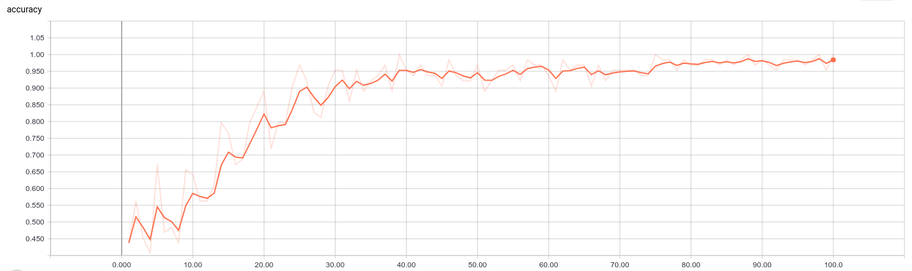</td>
	</tr>
</table>
<table>
	<tr>
		<td>Simple Crypt test results on partial cipher length.</td>
		<td>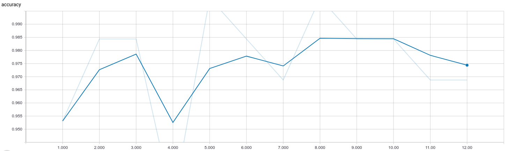</td>
	</tr>
</table>

##### Random partial cipher length
<table>
	<tr>
		<td>Simple Crypt train results on random partial cipher length.</td>
		<td>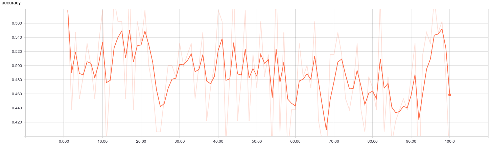</td>
	</tr>
</table>
<table>
	<tr>
		<td>Simple Crypt test results on random partial cipher length.</td>
		<td>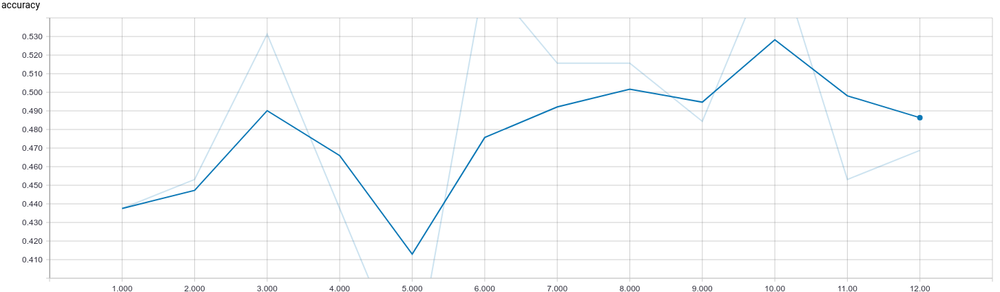</td>
	</tr>
</table>

#### AES
##### Full cipher length
<table>
	<tr>
		<td>AES train results on full cipher length.</td>
		<td></td>
	</tr>
</table>
<table>
	<tr>
		<td>AES test results on full cipher length.</td>
		<td>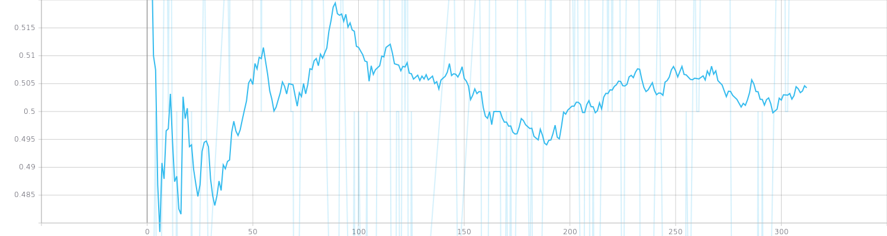</td>
	</tr>
</table>

##### Partial cipher length
<table>
	<tr>
		<td>AES train results on partial cipher length.</td>
		<td>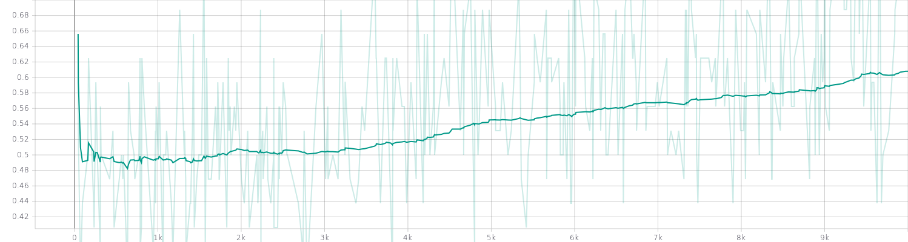</td>
	</tr>
</table>
<table>
	<tr>
		<td>AES test results on partial cipher length.</td>
		<td>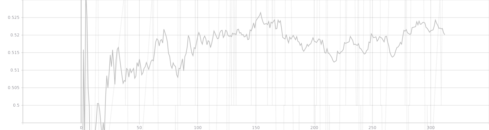</td>
	</tr>
</table>

##### Random partial cipher length
<table>
	<tr>
		<td>AES train results on random partial cipher length.</td>
		<td>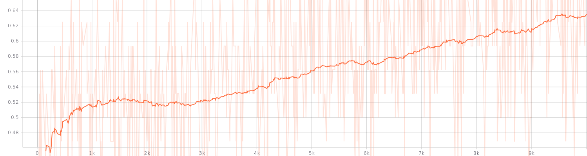</td>
	</tr>
</table>
<table>
	<tr>
		<td>AES test results on random partial cipher length.</td>
		<td>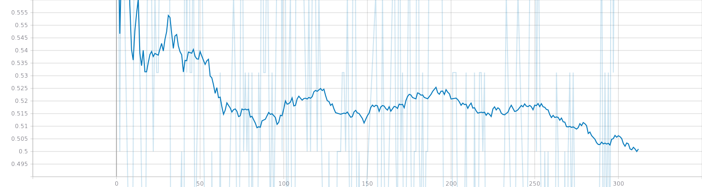</td>
	</tr>
</table>

#### DES
##### Full cipher length
<table>
	<tr>
		<td>DES train results on full cipher length.</td>
		<td>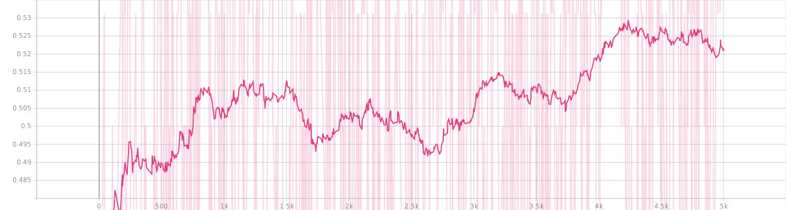</td>
	</tr>
</table>
<table>
	<tr>
		<td>DES test results on full cipher length.</td>
		<td>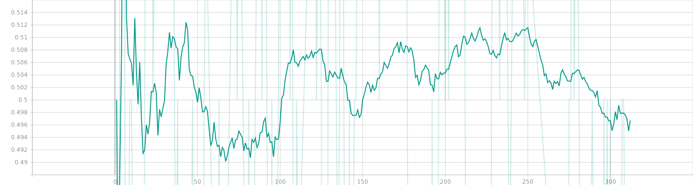</td>
	</tr>
</table>

##### Partial cipher length
<table>
	<tr>
		<td>DES train results on partial cipher length.</td>
		<td>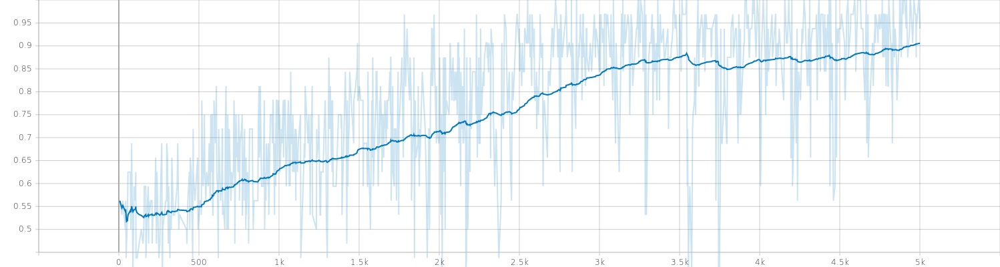</td>
	</tr>
</table>
<table>
	<tr>
		<td>DES test results on partial cipher length.</td>
		<td></td>
	</tr>
</table>

##### Random partial cipher length
<table>
	<tr>
		<td>DES train results on random partial cipher length.</td>
		<td>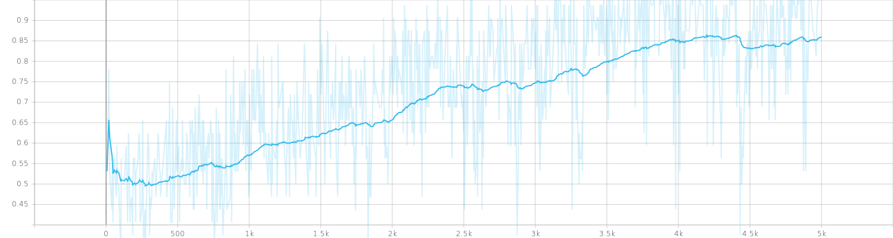</td>
	</tr>
</table>
<table>
	<tr>
		<td>DES test results on random partial cipher length.</td>
		<td>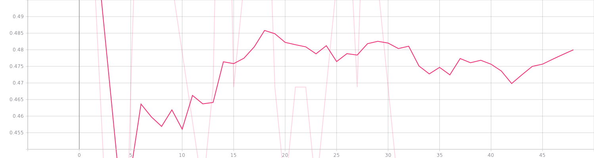</td>
	</tr>
</table>

# Final results using this methodology and algorithm are presented and explained in more details in the research paper.
